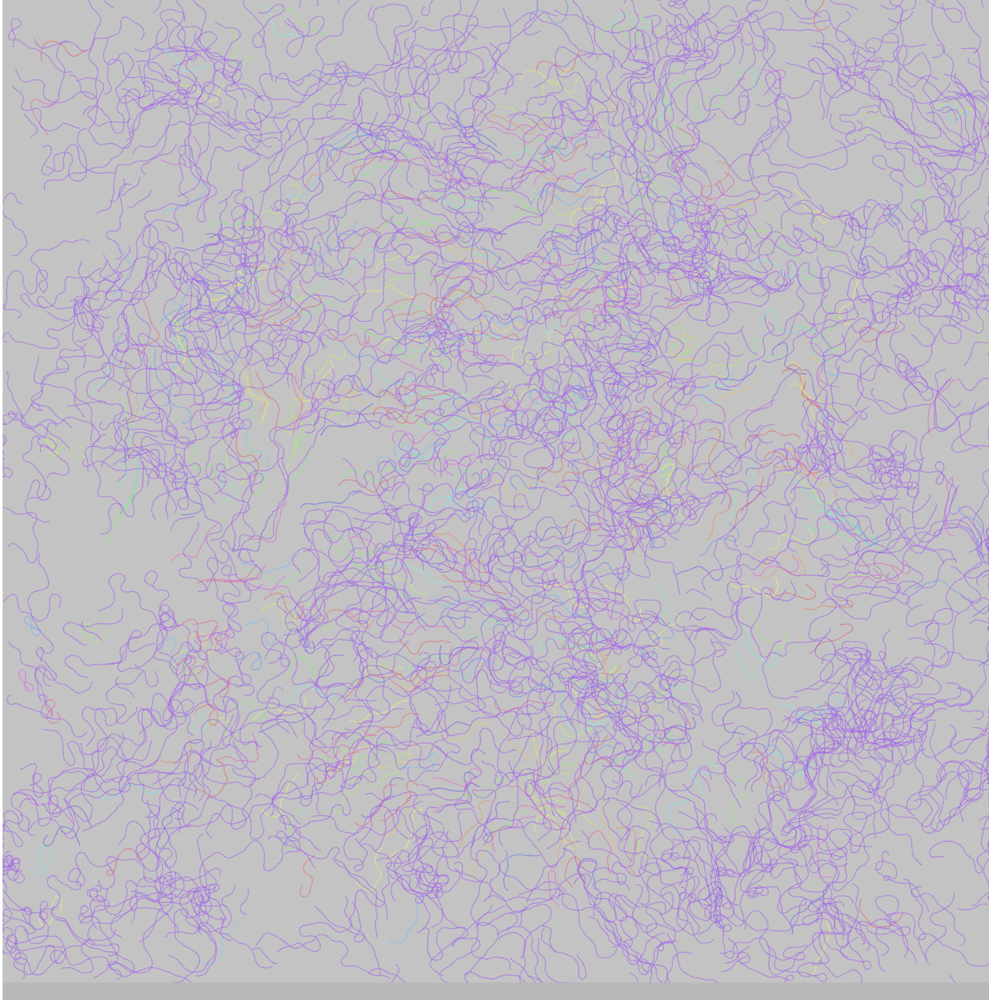
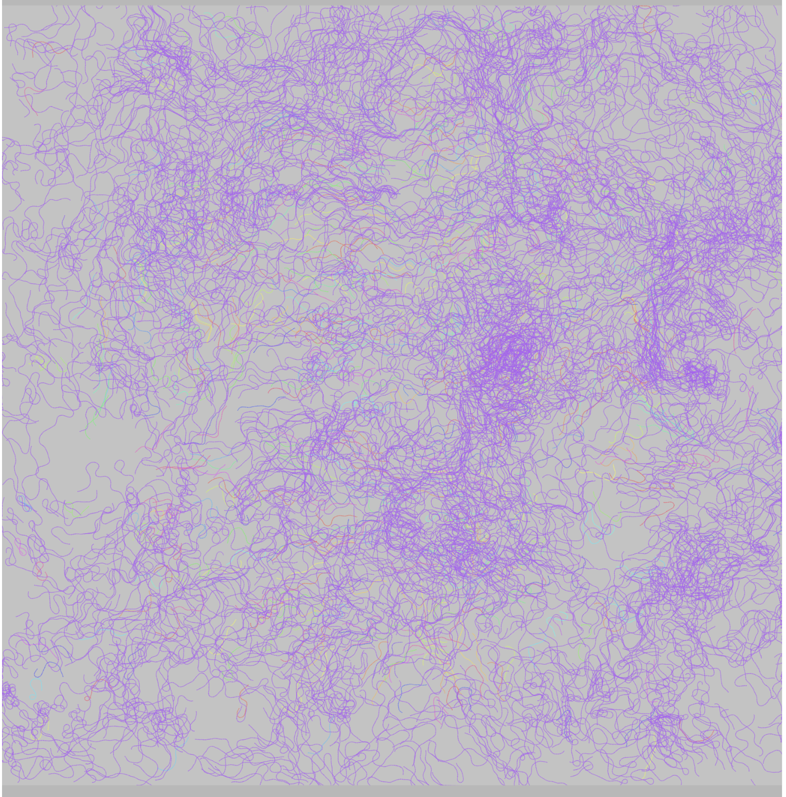
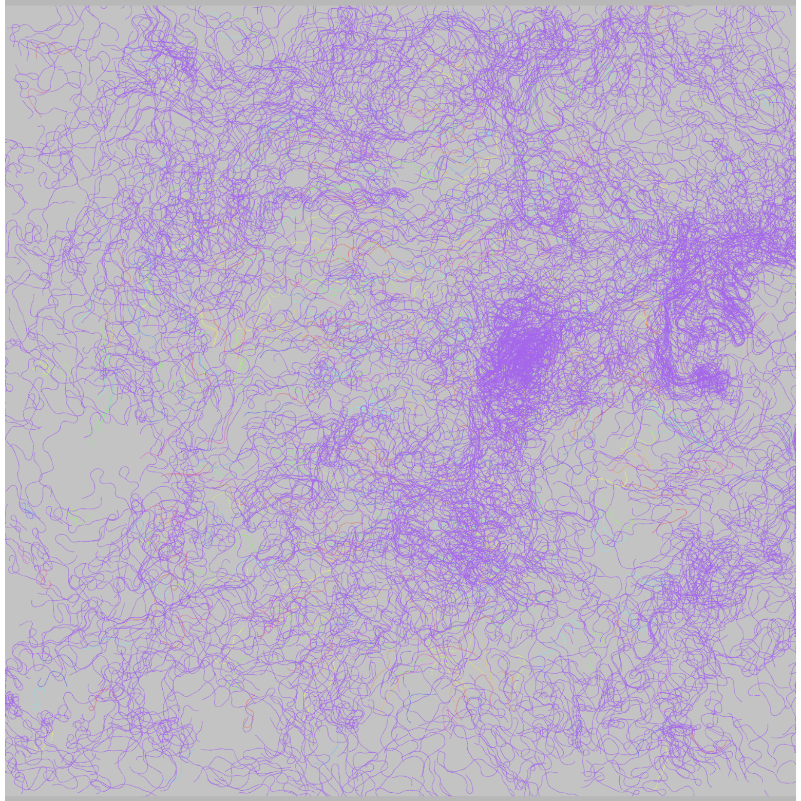
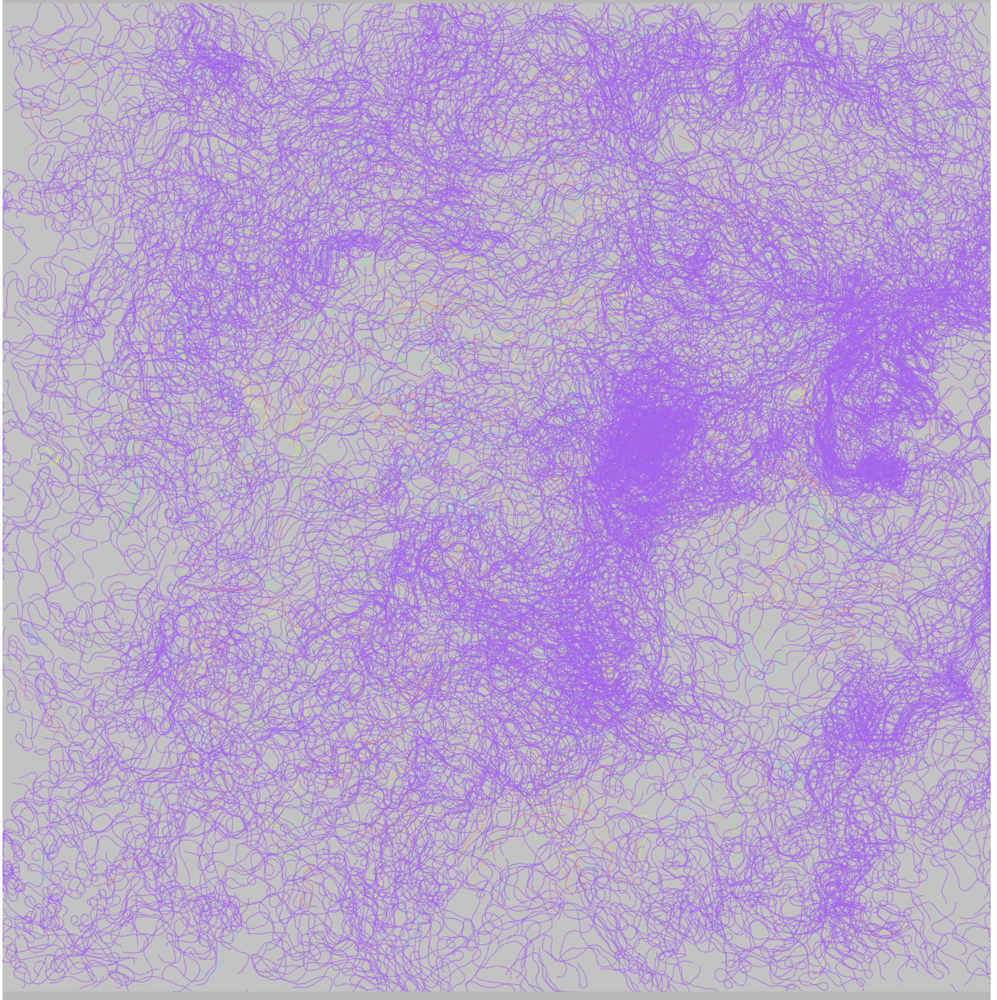

# **Quiz 8**

### _Part 1: Imaging Technique Inspiration_

#### Inspired by the interactive animated artwork glow__y from the p5.js community, I plan to layer random squiggly lines for my major assignment. Among the artworks listed in the brief, this technique is particularly well-suited to abstracting Claude Monet’s Saint-Georges majeur au crépuscule. Similar to glow__y, my piece will use multiple layers of colored lines that draw randomly on the canvas and accumulate over time. The direction of the lines will respond to where the user clicks on the canvas. Over time, the layered, interwoven lines will evoke the impressionist style seen in Monet’s work.

| glow__y stage 1 | glow__y stage 2|
|--------|--------|
|  | 
| glow__y stage 3 | glow__y stage 4|
|  | 

### _Part 2: Coding Technique Exploration_
#### The "random walker" coding technique, combined with the interactive mousePressed() function, will help implement the imaging approach. This technique creates lines that move in random directions frame by frame. By using the draw() loop without clearing the canvas, the lines gradually build up, resulting in an image that resembles an impressionist painting. The mousePressed() function adds interactivity by updating the x and y point of the lines with each mouse click, guiding the direction of the evolving artwork.

[Link to example implementation](https://p5js.org/sketches/2226058/)
